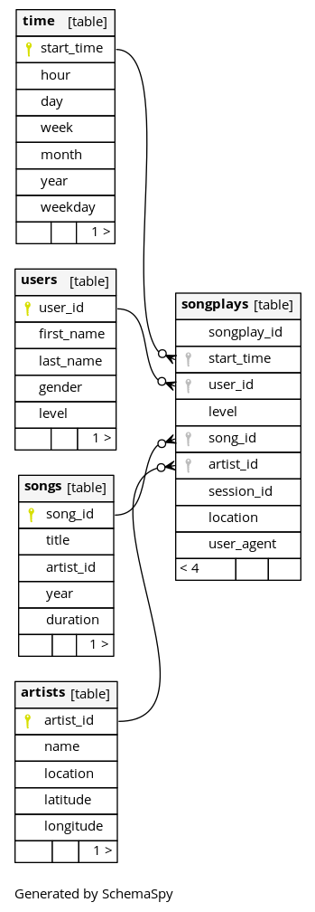

# Sparkify Redshift Cluster Datawarehouse with ETL pipeline

This project supports the Analytics team at Sparkify, a recent startup providing
a web and mobile music streaming app. The team has been collecting data about their
users (the ones who gave explicit consent according to 
[GDPR](https://eur-lex.europa.eu/eli/reg/2016/679/oj) regulations).
Such data has been loaded into an Amazon S3 Buckets from the JSON logs on user activity of the app and metadata of the songs
(as used by the app).
The aim of the project is to create an Amazon Redshift cluster as Datawarehouse, load the data from S3 Buckets into staging tables, extract/transform/load (ETL) the information to fill the database, and finally obtain useful insights, e.g. which songs Sparkify's users listen to.

## About SparkifyDB

The database is not normalized because it must be ready for analytical processing. 
There is no need to modify records quickly but instead to execute queries as fast as possible 
without many aggregations (or without aggregations at all).
The following star schema describes sparkifydb. The schema, as captioned, was generated with [schemaspy](http://schemaspy.org/)

 

As it can be seen in the Figure, there is one fact table called **songplays** and four dimension tables called respectively
**artists**, **songs**, **time**, and **users**. The star schema is self-explanatory. At the center of the schema ('the star') we can find the fact table, which is a derived table describing song, artist, time and user information all together. If there is a need of further details, foreign keys (FK) allow to retrieve, e.g., user's first_name. The key of **songplays**, i.e. songplay_id, is a surrogate key created for simplicity of indexing, so it does not naturally arises from the context. It is, in fact, autogenerated.

## Project Structure

The project is made of four Python scripts, along with a Makefile to make it easier to run all the steps.

### Amazon S3 Buckets Data

Two Buckets contain the data collected by the team split into song_data and log_data.
Each song can be reached by the first three letters of its ID. A song JSON file, e.g. data/song_data/A/A/A/TRAAAEF128F4273421.json, looks like the following listing:

```json
{
    "num_songs": 1,
    "artist_id": "AR7G5I41187FB4CE6C",
    "artist_latitude": null,
    "artist_longitude": null,
    "artist_location": "London, England",
    "artist_name": "Adam Ant",
    "song_id": "SONHOTT12A8C13493C",
    "title": "Something Girls",
    "duration": 233.40363,
    "year": 1982
}
```

It is possible to find null values of latitude and longitude, as shown above.

A log, e.g. excerpt of log_data/2018/11/2018-11-04-events.json, instead, contains the following information:

```json
{
    "artist": null,
    "auth": "Logged In",
    "firstName": "Theodore",
    "gender": "M",
    "itemInSession": 0,
    "lastName": "Smith",
    "length": null,
    "level": "free",
    "location": "Houston-The Woodlands-Sugar Land, TX",
    "method": "GET",
    "page": "Home",
    "registration": 1540306145796.0,
    "sessionId": 154,
    "song": null,
    "status": 200,
    "ts": 1541290555796,
    "userAgent": "Mozilla\/5.0 (Windows NT 6.1; WOW64; rv:31.0) Gecko\/20100101 Firefox\/31.0",
    "userId": "52"
}
```

### Python Scripts

- manage_clusters.py, can be used to create a 4-node Redshift cluster and all the resources needed to run the project. It can also be used to delete all the resources created (See [How To Run](#how-to-run)).
- sql_queries.py contains all the queries to create, drop, and populate both staging and final tables;
- create_tables.py allows for the creation of the tables with clean (empty) tables;
- etl.py implements the ETL pipeline to extract the data from S3 Buckets, load them into staging tables, and finally fill the final tables.

## How to Run

### Prerequisites

The project assumes you have a file dwh.cfg (included) with at least the following information:

```ini
[CLUSTER]
HOST = 
DB_NAME = 
DB_USER = sparkify_user
DB_PASSWORD = ...
DB_PORT = 

[IAM_ROLE]
ARN = 

[S3]
LOG_DATA = s3://udacity-dend/log_data
LOG_JSONPATH = s3://udacity-dend/log_json_path.json
SONG_DATA = s3://udacity-dend/song_data
```

Please, see Redshift documentation before choosing a Master User and a Master Password (follow their strict criteria, e.g. at least one upper case letter for passwords).

You also need to set three environment variables with your credentials and region (or have aws-cli credentials properly configured):
AWS_ACCESS_KEY_ID, AWS_SECRET_ACCESS_KEY, AND AWS_DEFAULT_REGION (See [boto3-doc](https://boto3.amazonaws.com/v1/documentation/api/latest/guide/configuration.html)).

If you decide to use your own created cluster, fill all the fields and you can skip the cluster creation step. Otherwise, follow along and the scripts will take care of the rest.

#### Terraform

If you would like to use the provided Terraform code (in iac/) you need to install [Terraform](https://www.terraform.io/)

### Using the Makefile

The easiest way to run the project is using the Makefile.

To create a Python virtualenv do:

```Makefile  
make setup
```

Then, install all the requirements with:

```Makefile
make install
```

To create a cluster suitable to run the project do:

```Makefile  
make cluster
```

Or, in alternative, if you have Terraform installed:

```Makefile  
make tf-cluster
```

To delete all the resources created by the previous command on AWS type:

```Makefile  
make clean
```

Or, in alternative, if you have Terraform installed:

```Makefile  
make tf-clean
```

Finally, to create the tables and start the ETL pipeline run: 

```Makefile  
make etl
```

Python code has been linted with pylint and formatted with black using:

```Makefile  
make lint && make format
```

To rebuild all the tables run:

```Makefile  
make create
```

### Without the Makefile

A Makefile can be run on any Unix-like systems thanks to GNU Make.
If you do not have Make on Windows you can use [chocolatey](https://chocolatey.org/) and install it.
If you do not wish to install Make, you can run the following commands:

To set a virtualenv:

```Bash  
python3 -m venv .env/sparkifydb
```

To install the required libraries:

```Bash  
python3 -m pip install --upgrade pip && python3 -m pip install -r requirements.txt
```

Prepare a suitable Redshift cluster on AWS:

```Bash
python3 manage_cluster.py create
```

With Terraform:

```Bash
terraform init iac/ && terraform plan iac/ && terraform apply iac/
```

To destroy all the resources created on AWS by the previous script:

```Bash  
python3 manage_cluster.py delete
```

With Terraform:

```Bash  
terraform destroy iac/ -auto-approve
```

To drop and re-create all the tables:

```Bash
python3 create_tables.py
```

Run the ETL pipeline:

```Bash
python3 etl.py
```
